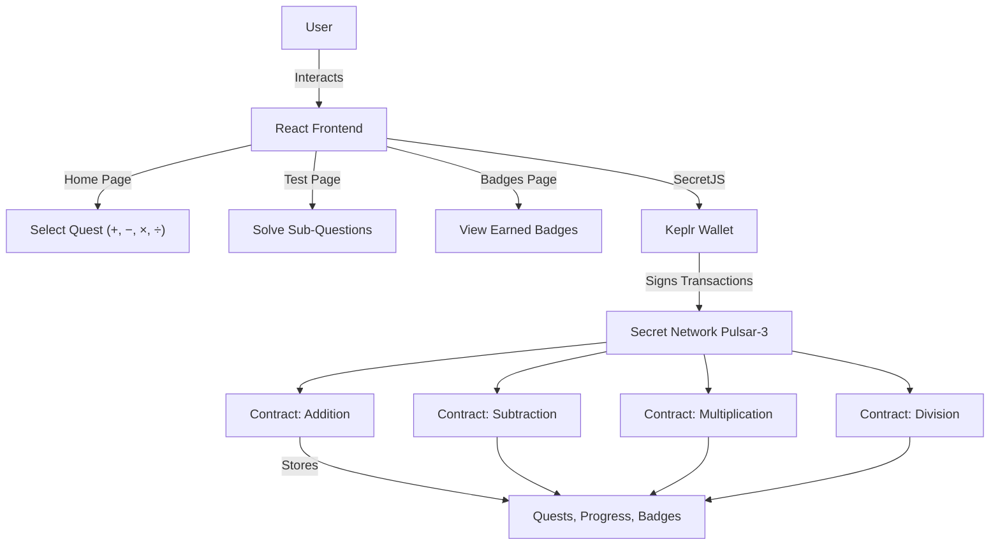

# Math Badge Quest: A Decentralised Application for Gamified Math Learning on Secret Network

**Author**: Shyam Hari

## Abstract

Math Badge Quest is a decentralised application (dApp) designed to make math learning more engaging through gamified challenges and on-chain rewards. Deployed on the Secret Network's Pulsar-3 testnet, it invites users to solve five randomly generated arithmetic problems covering addition, subtraction, multiplication, and division to earn unique NFT badges. These badges are securely stored on-chain and privately owned, thanks to Secret Network’s privacy-focused smart contracts.

The platform is built with CosmWasm and features a React frontend integrated via SecretJS and Keplr, allowing for seamless wallet connection and transaction handling. By combining privacy and game-like incentives, Math Badge Quest offers a novel approach to educational mathematics tools on the blockchain. This whitepaper outlines the problem it addresses, related work, its technical architecture, contract design, frontend flow, implementation choices, and also explores future enhancements.

## Problem Statement & Motivation

It’s no secret that staying motivated to practice math, especially on your own, can be tough. While platforms like Khan Academy offer great learning resources, they often fall short when it comes to keeping students engaged over time. There’s usually no real reward for progress, and users have to trust centralised systems with their personal learning data.

Math Badge Quest takes a different approach. It turns math practice into a game, where users solve arithmetic problems to earn unique NFT badges. These badges act as digital trophies, proving what you’ve accomplished and because they live on the blockchain, no one can take them away or fake them.

What makes this platform special is that it’s built on the Secret Network, which means your progress and achievements stay private and secure. A decentralised approach is especially appropriate here because it removes the need to trust a central authority, ensuring trustlessness so achievements cannot be tampered with, privacy so only you control who sees your data, censorship resistance so badges cannot be unfairly removed, and true ownership where your badges are yours alone to keep, share, or transfer. This transparency and user empowerment are key to motivating learners and educators over time in a fair and secure way.

The goal is to make math practice more rewarding, private, and fun for students, lifelong learners, or anyone who wants to sharpen their skills. By removing the need to trust a central authority and giving users full ownership of their achievements, Math Badge Quest brings transparency and motivation to math learning in a new way.

## Related Work & Context

Educational dApps are steadily gaining momentum across blockchain ecosystems, often using tokens or NFTs to reward learning milestones and enhance user engagement through gamification.

Several projects have explored this approach by integrating interactive learning with blockchain-based incentives. For example, BitDegree incentivizes online course completion with token rewards, encouraging continued participation. The Swanky Manky Math Game introduces arithmetic puzzles, where solving problems earns NFTs. EduF4All uses smart contracts and NFTs to issue decentralised certificates, aiming to improve access to quality education.

Math Badge Quest takes these concept further by combining interactive arithmetic practice with NFT rewards and strong privacy guarantees. Built on the Secret Network, it uses encrypted smart contracts and on-chain randomness to generate dynamic math challenges while keeping user progress and NFT ownership private. This creates a secure, gamified learning experience, marking Math Badge Quest as a novel contribution at the intersection of education, interactivity, and privacy in blockchain.

## Architecture & Contract Design

Math Badge Quest's architecture integrates a React frontend, SecretJS for blockchain communication, and CosmWasm smart contracts on Secret Network's Pulsar-3 testnet. The frontend interacts with four contract instances—one for each operation (addition, subtraction, multiplication, division)—via SecretJS, with Keplr handling wallet authentication. The user flow is: connect wallet → select quest → solve problems → earn badge, all secured by Secret Network's privacy layer.

### Architecture Diagram

### Contract Schema

The smart contract defines:

- **InstantiateMsg**: Initializes the contract with an owner address.
- **ExecuteMsg**:
  - `AddQuest {id, operation}`: Owner creates a quest with five sub-questions for the specified operation (+, −, ×, ÷).
  - `SubmitSolution {quest_id, sub_question_index, solution}`: Users submit answers; completing all five sub-questions awards a badge.
- **QueryMsg**:
  - `GetQuest {id, sub_question_index}`: Retrieves quest or specific sub-question details.
  - `GetUserBadges {user}`: Returns user's badge IDs.
  - `GetUserProgress {user, quest_id}`: Returns user's progress as a boolean array.

### State Layout

State is managed using `secret-toolkit`'s `Keymap` and `Item`:

- `OWNER`: Stores the canonical owner address.
- `TOKEN_COUNT`: Tracks total badges issued.
- `QUESTS`: Maps quest IDs to `Quest` structs (five `SubQuestion`s with operation, operands `a` and `b`, and answer).
- `COMPLETIONS`: Tracks user completions by `(user, quest_id)`.
- `USER_PROGRESS`: Stores progress as a boolean array for `(user, quest_id)`.
- `BADGES`: Maps badge IDs to `Badge` structs (owner, quest_id, token_uri).

### Special Features

- **Random Problem Generation**: Uses Secret Network's `env.block.random` and SHA-256 hashing to create unique sub-questions (e.g. `a + b` where `1 ≤ a, b ≤ 100` for addition; `a ÷ b` ensures divisibility for division).
- **NFT Badges**: Issued as CW-721-compatible tokens with IPFS metadata (`ipfs://math_quest/operation/token_id`).
- **Role-Based Access**: Only the owner can add quests; any user can submit solutions.

### Security Considerations

- **Access Control**: Restricts `AddQuest` to the owner, preventing unauthorised quest creation.
- **Input Validation**: Checks sub-question indices and solutions to avoid out-of-bounds or incorrect submissions.
- **State Integrity**: Prevents badge re-issuance for completed quests using `COMPLETIONS`.
- **Edge Cases**: Handles invalid input, operations and ensures randomness availability.
- **Migration Path**: Owner can be updated.

## Frontend Workflow & UX

The React frontend, served via Vite and incorporating Tailwind CSS, includes three pages:

- **Home**: Displays app description and large, styled buttons for selecting quest types (+, −, ×, ÷), guiding users to start a quest. A prominent "Connect Wallet" button initiates Keplr wallet authentication.
- **Test**: Presents one sub-question at a time (e.g "52 + 31 = ?") in a clear layout, with a text field for user input and a "Submit Answer" button. Progress is queried on load to resume incomplete quests, ensuring continuity.
- **Badges**: Shows earned badges with descriptive names (e.g. "Addition Badge") in a responsive grid layout.

### Key User Interactions

- **Wallet Connection**: Users click the "Connect Wallet" button on the Home page, triggering a Keplr wallet popup to authenticate and link their Secret Network address. Upon successful connection, the button updates to show the wallet address (partially masked for privacy, e.g. "secret...2nbr").
- **Transaction Flow**: On the Test page, after entering an answer and clicking "Submit Answer," the UI prompts users to confirm the transaction via Keplr’s popup, which displays gas fees and transaction details. SecretJS submits the solution to the smart contract. Upon confirmation, the UI updates with feedback (e.g. "Correct! Moving to question 2 of 5" or "Incorrect Solution, try again"). After solving all five sub-questions, a final transaction mints the NFT badge.
- **User Workflow**:
  1. Click "Connect Wallet" to authenticate via Keplr.
  2. Select a quest type (+, −, ×, ÷) from the Home page.
  3. Solve five sub-questions sequentially on the Test page, confirming transactions after each submission.
  4. View earned badges on the Badges page.

### Error Handling

- **Incorrect Solutions**: Displays "Incorrect solution, try again" above the input field, allowing user to re-attempt the same question, until they get it correct.
- **Network Issues**: Shows a notification if Secret Network or SecretJS fails.
- **Transaction Failures**: Alerts users if a transaction is rejected (e.g. user does not select approve and instead closes transaction prompt), and a prompt to retry.
- **Wallet Disconnections**: Detects if Keplr disconnects (e.g. user clicks disconnect button mid-quest), prompting user reconnection.

The UI is responsive, with clear feedback (e.g. "Correct! Moving to question 2 of 5") and navigation links (e.g. "View your badge"). A progress bar indicates the current question (e.g. "Question 3 of 5"), enhancing usability.

## Implementation Choices & Trade-Offs

1. **On-Chain Randomness**:
   - **Choice**: Using `env.block.random` with SHA-256 hashing generates dynamic, unpredictable problems, enhancing replayability.
   - **Trade-Off**: Depends on on-chain randomness, which can introduce variability in problem difficulty, potentially affecting user experience consistency. Hashing the block height was considered, but not implemented due to its predictability and lower security guarantees.

2. **Multiple Contract Instances**:
   - **Choice**: Deploying one contract per operation (+, −, ×, ÷) isolates state and simplifies logic.
   - **Trade-Off**: Increases deployment and gas costs compared to a single contract handling all operations. Requires 4 contracts to be created to run the front end (one for each operator).

## Future Work & Roadmap

- **Customisable Quest Length**: Allow admins to set quest length (e.g. `x` questions), enabling flexible quest creation for different educational needs.
- **Operand Digit Control**: Enable admins to specify the number of digits in equation operands, enhancing customisability and supporting varied difficulty levels while preserving on-chain randomness for decentralised problem generation.
- **Increase Quest Library**: Expand the quest library to include diverse math problems, such as word problems, calculus (e.g. derivatives), and statistics (e.g. probability), broadening the dApp’s appeal across skill levels.
- **Tiers for Badges**: Introduce bronze, silver, and gold badge tiers for each quest type, with increasing difficulty (e.g. harder problems or time limits), rewarding users for advanced achievements.
- **Enhanced Badge Design**: Improve the visual appeal of badges with dynamic NFT attributes (e.g. animated designs, rarity tiers, or custom artwork), making them more engaging as collectibles.
- **Pay-to-Unlock Quests**: Implement a SNIP-20 token payment system to unlock premium quests with special badges, adding a monetization layer and leveraging Secret Network’s private token capabilities.

## References

- CW-721 NFT Standard: <https://github.com/public-awesome/cw-nfts/blob/main/packages/cw721/README.md>
- BitDegree: <https://www.bitdegree.org>
- Swanky Manky Math Game: <https://ethglobal.com/showcase/swanky-manky-math-game-yonwk>
- Edu4All <https://devpost.com/software/edu4all-decentralized-education-platform>